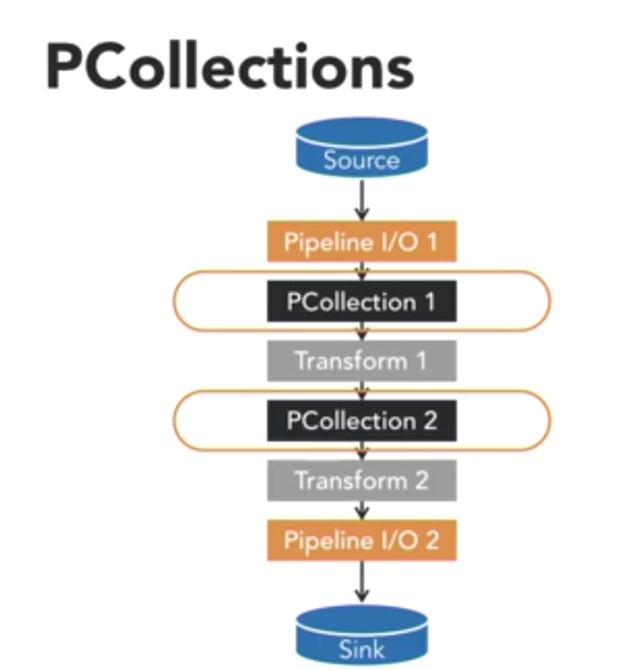
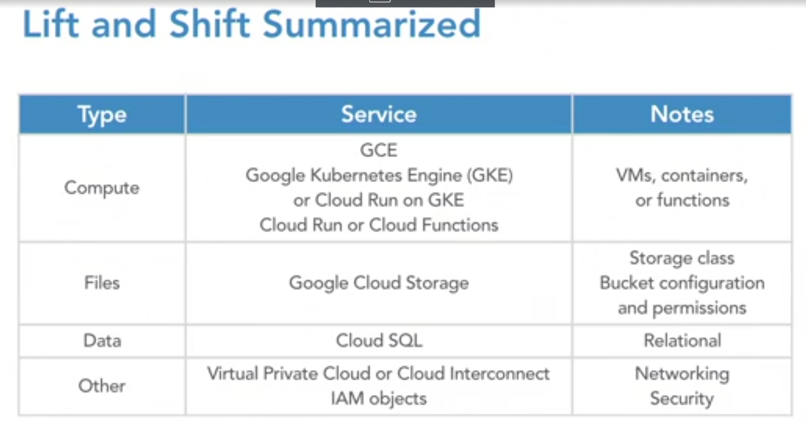
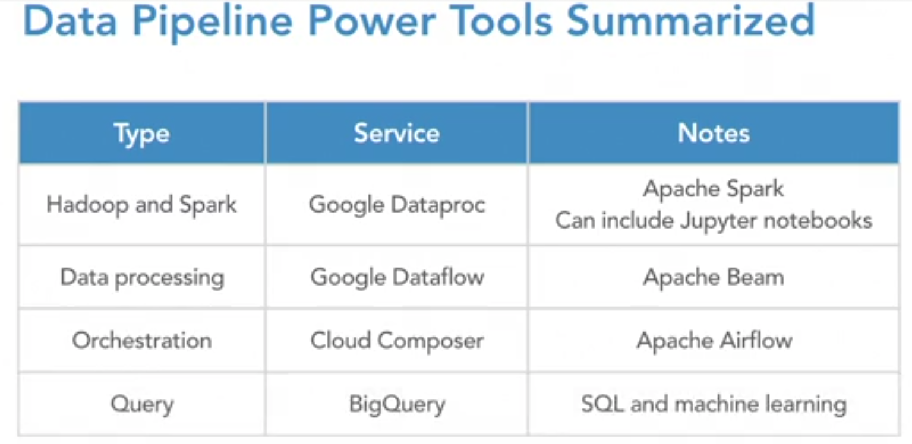
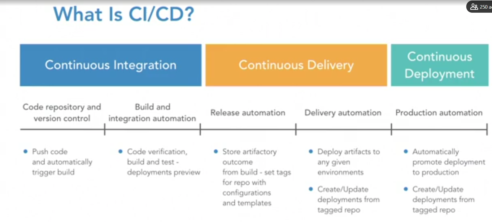
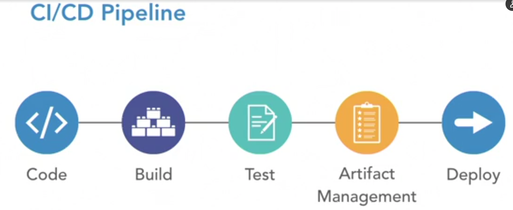

# Google Cloud Platform

## Google Cloud SDK CLI Tools
+ gsutil - for Google Cloud Storage
+ bq - for BigQuery
+ gcloud - for the rest of Google Cloud

## Google Cloud Pipelining Tools
+ Cloud Dataproc - Managed version of Hadoop and Apache Spark Service
  - HDSFS, MapReduce, Spark Programming.
  - Automatic Cluster management
  - Pay as you use
  - Portable Code
+ Cloud Dataflow - Apache Beam managed product
  - Fully managed batch and stream processing service
  - Native GCP product - does not provide portability to other platforms
  - Apache Beam-based programming model
  - Scalable execution engine
  - Integration with other GCP products
  - Automated resource management
+ Cloud Pub/Sub
  - Native message queue on GCP, similar to Kafka and Kinesis
  - Doesn't work on other cloud platforms
  - Multiple interfaces, including REST APIs, SDKs, and connectors
  - Fully managed and auto-scalable
  - Secure
+ Cloud Dataprep - Ability to process data for analytics

## Cloud Dataproc
Hadoop is made up of these two items
+ HDFS - Hadoop Distributed File System
+ MapReduce - Distributed Computing. Later on it was split into two components
  + YARN - Yet Another Resource Allocator. Works as a traditional operating 
    system. Its job is to take in the map reduce jobs and then assign computing
    to them.

## Cloud Dataflow
### Apache Beam:
+ Common pipeline definition model
+ Extract, transform, and load (ETL) tasks
+ Separates definition from execution
+ Multiple programmin SDKs, such as Java, Python, and Go
+ Multiple execution options, such as Native, Flink, Spark, and Cloud Dataflow
+ Open source
+ Both batch and streaming

#### Pcollections
Represent a working dataset in the data pipeline. You can think of it like an
in memory keep storage. Like a java collection or python data frame.

It is created by other operations in the pipeline and it is used by down stream
stages.

It can serve as inputs and outputs for processing transformations

#### Transforms
+ A processing step
+ Transform input PCollection to output PCollections
+ Used for cleansing data record by record
+ They can be executed in parallel across many nodes
+ Aggregations
+ Defined through language SDK

#### Pipeline I/O
+ External data sources and sinks

#### Runners
+ Executes a pipeline
+ Allows you to develop and test your pipeline on your laptop using the native
  runner direct runner.
+ DirectRunner, FlinkRunner, SparkRunner, DataflowRunner
+ Code once, run on different runners

## Tooling and Code
+ Select, congiure, and secure tools
  + gcloud for scripting - integrated terminal or local install
    + You can also use the python API for scripting
  + GCP SDK - select language (python) and IDE (use plugins(vscode))
  + Third party - Terraform and more

## Functions as a Service
You are only charged when the function is invoked. So it can save you a lot of
money.

## Cloud Run
You can bring your own container so you can run any service on here. With 
functions you are limited to the languages that are provided. What GCP does in
cloud run is to manage the container cluster for you. It is running the 
containers under the hood using kubernetes but you are not seeing that happen.

Two Modes
+ One appears like functions
+ Cloud Run on Google Kubernetes Engine

### Knative
Library sitting on top of Kubernetes to give you another layer of abstraction.
It was developed to make it easier for developers to work with Kubernetes.

## Data Pipelines

