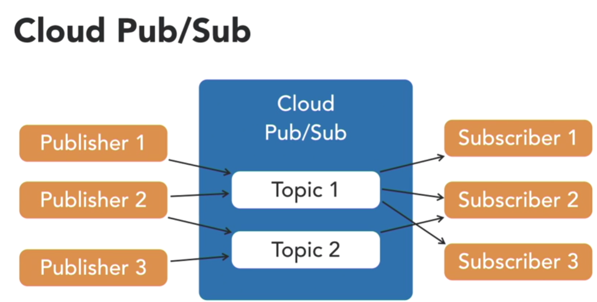

## Start Virtual Environment

```bash
source env/bin/activate
```

## Pipeline Tutorial

The python package`google-cloud-dataflow` cannot be used any more it only works
on Python >=2.7, <3.0 so I need to install Apache-beam with gcp.

## Python Development Environment on Google

+ [Setting Up Python Development Environment](https://cloud.google.com/python/docs/setup#linux)
  - During this process the installs failed on the virutal environment because
    I needed to install git. I installed git with the following command.

    ```bash
    $ sudo apt update
    $ sudo apt install git
    ```
  - I also got the following error

    ```bash
    Command "python setup.py egg_info" failed with error code 1 in /tmp/pip-install-ey2b6adp/grpcio/
    ```

    After doing some research I found that I could do the following. This did
    not help
  - After that didn't work I tried the following command for Debian which I
    found in this [thread](https://github.com/grpc/grpc/issues/24556)

    ```bash
    sudo apt install build-essential
    ```
+ The thing that finally got this to work from me was to just install

```bash
sudo apt update
sudo apt install python3 python3-dev python3-venv pipenv
pipenv --three
```

apache-beam with the following two commands in a pipenv environment.

```bash
  pip install apache-beam
  pip install apache-beam[gcp]
```

Once this was installed I was able to run

```bash
python -m apache_beam.examples.wordcount --output outputs
```

Then to review the output you can do

```bash
more outputs*
```

Or the one I prefer is

```bash
cat outputs*
```

---

## Google Cloud SDK

[Google Cloud SDK cheat sheet](https://cloud.google.com/sdk/docs/cheatsheet)

---

## Google DataFlow

### Setting up Python

```bash
pip3 install --upgrade virtualenv --user
```

Create python virtual environment

```bash
python3 -m virtualenv env
```

activate virtual environment

```bash
source env/bin/activate
```

### Install apache-beam in the virutal environment

```bash
pip3 install --quiet \
    apache-beam[gcp]
```

### Create a Cloud Storage Bucket

```bash
gsutil mb gs://name-your-bucket
```

### Launch your pipeline on the Dataflow Service

```bash
d
python3 -m \
    apache_beam.examples.wordcount \
    --project project-id-here \
    --runner DataflowRunner \
    --temp_location \
    gs://name-your-bucket/temp \
    --output \
    gs://name-your-bucket/results/output \
    --job_name dataflow-intro \
    --region us-central1
```

### Loading Text Files

### ParDo Transform

+ ParDo takes as input a row of data from a PCollection
+ Performs any custom defined operation
+ Outputs to the resultant PCollection
+ Custom operation can be defined in a function
+ ParDo executes tranforms on individual records in parallel using multiple nodes

### Map Transform

+ A Map transform takes a PCollection and outputs another PCollection of the same size
+ Can be used to summarize data

### Apache Beam: Other Capabilities

+ FlatMap - splits a record into multiple records
+ Flatten - merges multiple similar PCollections
+ Partition - breaks up a PCollection into many
+ Side Inputs - enhance DoFn() processing

---

## Google Cloud Pub/Sub

+ Pub/Sub: Real-time asynchronous message queue (Asynchronous messaging middleware)
+ Similar to Apache Kafka, JMS (Java Message Service), Amazon Kinesis
+ Multiple topics, subscribers, and publishers
+ Fully managed and scalable
+ Data reliability and high availability
+ Delivery guarantees
+ End-to-end security
+ Publishers and Subscribers don't need to know about each other.



### Topics

+ A named data queue in Pub/Sub
+ Unit of data = Message; Considered equivalent to a record in a database table
+ Multiple publishers and subscribers
+ FIFO not guaranteed
+ Asynchronous
+ Data retention - 7 days
+ You can have multiple subscriptions per topic

### Messages

+ A data element/record in the topic
+ Sent by publishers
+ Received/pulled by subscribers
+ Contains data and optional attributes
+ Secure transport

### Publishers

+ Pushes messages into a topic
+ Multiple publishers per topic
+ Preformats data if required
+ Uses predefined interfaces
  + SDKs
  + REST - can be used to push data from external sources
  + Command line options to publish from
  + GCP Console also provides publishing options

#### Publisher Examples

+ Enterprise applications
+ IoT Edge devices pushing events
+ Clickstream events from web applications
+ Logs from applications
+ Database updates relay

### Subscribers

+ Receives messages from a topic
+ Multiple subscribers per topic
+ Pull/push to callback
+ Postprocessing of messages
+ Uses predefined interfaces
  + SDKs
  + REST
  + Command line
  + Console

#### Subscriber Examples

+ Archive events in Cloud Storage
+ Cleanse events and relay to another topic
+ Monitor events for exceptions and alerts
+ Real-time summaries

### Creating a Topic

+ REST API

`PUT https://pubsub.googleapis.com/v1/projects/project-name/topics/topic-name`

+ gcloud command

` gcloud pubsub topics create topic-name`

+ SDK (Python etc.)

` topic = publisher.create_topic('test-project/topics/test-topic')`

+ Console

Subscriptions also have the same list of options for creating them

### Commands

Pulling data from a topic to a subscription

```bash
gcloud pubsub subscriptions pull --auto-ack test-subscription
```

---


## Google Cloud Storage

[Google Cloud Storage Quickstart](https://cloud.google.com/storage/docs/quickstart-gsutil)

### Make Bucket in gsutil

```bash
gsutil mb gs://name-your-bucket
```

### Copy file from local directory to the bucket

```bash
gsutil cp Desktop/kitten.png gs://name-your-bucket
```

### Download Object from your bucket

```bash
gsutil cp gs://name-your-bucket/kitten.png Desktop/kitten2.png
```

### Delete the bucket and anything inside of it

```bash
gsutil rm -r gs://name-your-bucket
```

---

### Google Cloud Compute Engine (Virtual Machines)

Setup gsutil from within the vm.
[Guide](https://cloud.google.com/compute/docs/disks/gcs-buckets)

```bash
gcloud init
```
