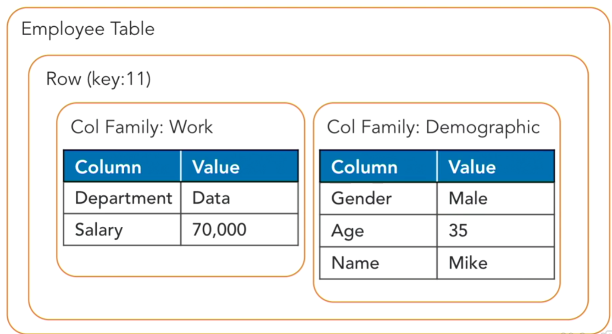

# HBase
Hadoop doesn't really support transaction needs. It is more batch oriented. This
is where you would use HBase.

## HBase: The Hadoop Database
+ Schema
+ Fast
+ Random Access
+ Allows CRUD

This can give you the benefits of Hadoop along with the benefits of a 
traditional database.

## Companies Using HBase
### Facebook Messenger
+ 1.2 billion monthly users
+ 60 billion+ messages per month
+ Real-time chat, video, and calling

### Airbnb Streaming
+ Airstream
+ Booking events
+ Real-time ingestion

### Spotify
+ 100 million users
+ 30 million songs
+ 1.5 TB user data per day
+ 64 TB Hadoop data per day

## CAP Theorem
+ Consistency
+ Availability
+ Partition Tolerance

Each data platform can only have two of these at the same time. HBase is 
consistent and partition tolerant.

### Key-Value Store


### Document Store

### Graph Databases

### Column Families
This is what HBase uses


## HBase Interface Options
+ Shell (JRuby)
+ Java API
+ Apache Phoenix (OLTP on top of HBase)

## Columnar vs. Row Layout

<br>


We can compress this data even further with the example of the state of 
California. By only storing the value `CA` once and then assigning peoples
ID's as pointers. This gives us an advantage over normal row tables. Because
then the data  won't be stored if it is not needed yet.


# HBase Terminology
<!--- Where did this come from --->


+ Namespaces - Logic grouping of tables
+ Versioning - Happens at the individual value level. So your HR system may not
  track data over time. But with HBase you can query the data and ask for the
  specific information that was active at that time.


Above it shows Mikes data stored with a time stamp. t1 Mike is working in the IT
department. But we can see in T2 that Mike has moved over to the Data 
department. Then in t3 his work with the company has ended. Below is how it
could be structured in HBase. With the time stamp you can specify what time 
stamp to return. But if you omit that from your query you will just get the most
recent time stamp returned.


The column families would be split out among differnt files.


## HBase Namespaces
Create statements
```bash
#Create a Namespace
create_namespace 'people'

#create employees in 'people' namespace
create 'people:employees', 'work', 'demo'

# drop namespace
drop_namespace 'people'

# alter namespace
alter_namespace 'people', {METHOD => 'set', 'PROPERTY_NAME' => 'PROPERTY_VALUE'}
```
for this course we are going to be using the default namespace

## Data Model Operations in HBase

## Version with Timestamps in HBase