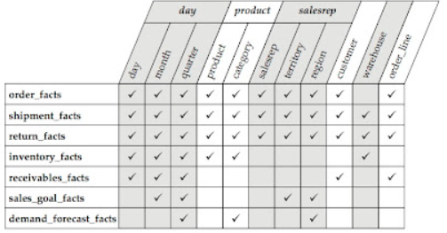

# Data Warehouse Design Template

## Design Documentation Sections
+ Requirements Documentation
  + Captures measurement requirements by process in each major subject area.
  + What fact, figures, statistics, and so forth do you need for effective decision making?
+ Top-level Design Documentation
  + Describes the stars for each process and the associated conformed dimensions
  + Technical and functional description of each star
  + How should this information be sliced and diced for analysis? (dimensions)
  + What additional information can aid in finding exactly what is needed? (attributes)
+ Detailed Design Documentation
  + Column-by-column specifications for each table

# REQUIREMENTS DOCUMENTATION
---
|Item|Description|Notes|
|-|-|-|
|Subject Area Description|Defines the subject area and maps it to familiar business processes|This can usually be accomplished in one or two sentences|
|Roles|States the interest each department or user group has in the subject area|This helps prevent subject areas from being confused with departments. Single phrases or short sentences should do the job.|
|Analytic Requirements|Statements describing the kinds of measurements and level of details|These statements will strike you as similar to grain statements for fact tables, but here they express very specific business requirements|
|Process Measurement|Specific breakdown of measurements, broken into group sby process along with associated dimensional context|These statements detail the facts associated with each analytic requirement, as well as the major dimensions of analysis|

## Sales Subject Area Example
#### Description:
+ Engagement of prospects and customers for the purpose of securing new orders

#### Roles:
+ Sales: Direct sales activities, including sales calls, proposal creation, and order taking
+ Sales Management: Monitoring activities of sales people
+ Marketing: Correlation of orders with marketing activity
+ Fulfillment: Use of sales data for demand forecasting and inventory management
+ Finance: Computation of salesperson commission payments

#### Analytic Requirements:
1. Tracking sales calls by date, salesperson, and customer
2. Proposal information by proposal line, date, salesperson, customer, and product
3. Order Information by order date, order line, salesperson, customer, and product
4. Shipments by shipment date, shipment line, salesperson, customer, product, order line, and order date
5. Returns by date, reason, product, customer, order line, and salesrep

#### Process Measurement:

<table class="tg">
<thead>
  <tr>
    <th class="tg-0pky">Process</th>
    <th class="tg-0pky">Measurements</th>
    <th class="tg-0pky">Measurement Context</th>
  </tr>
</thead>
<tbody>
  <tr>
    <td class="tg-0pky">Sales calls</td>
    <td class="tg-0pky">Number of sales calls</td>
    <td class="tg-0pky">Date/Time Salesperson Customer Call Type</td>
  </tr>
  <tr>
    <td class="tg-0pky">Proposal</td>
    <td class="tg-0pky">Proposal Quantity Proposal Dollars</td>
    <td class="tg-0pky">Proposal Line ID Salesperson Customer Product Proposal Type</td>
  </tr>
  <tr>
    <td class="tg-0pky">Orders</td>
    <td class="tg-0pky">Order&nbsp;&nbsp;Quantity Order Dollars Order Cost Dollars Margin Dollars</td>
    <td class="tg-0pky">Order Line Order Date Salesperson Customer Product</td>
  </tr>
  <tr>
    <td class="tg-0pky">Shipments</td>
    <td class="tg-0pky">Shipment Quantity Revenue Dollars</td>
    <td class="tg-0pky">Shipment Date Shipment Line ID Shipper Product Customer Salesperson Order Line Order Date</td>
  </tr>
  <tr>
    <td class="tg-0pky">Returns</td>
    <td class="tg-0pky">Quantity Returned Return Dollars Return Cost Dollars Return Margin Dollars</td>
    <td class="tg-0pky">Return Date Order Line Order Date Salesperson Customer Product Return Reason</td>
  </tr>
</tbody>
</table>

# TOP-LEVEL DESIGN DOCUMENTATION
---
## Sections
+ Definitions for each star
+ Definitions for each dimension
+ Conformance Matrix

# DETAILED DESIGN DOCUMENTATION
---

# Documentation to Merge into above

## Business Need
Example: Number of accepted products by batch, by product, by machine, by day

## Available Data
Example: Export file from manufacturing contains one row for each product. Each row includes, product, raw material 
batch number, machine number, operator employee number, start time, end time, reject flag.
## Measures
+ Create Measures
  + Monetary Amounts
    + Cost of raw materials
    + Value of a sale
    + Operational Expenses
    + Labor Expenses
  + Counts
    + Number of items produced
    + Number of items ordered
    + Number of items shipped
    + Number of calls to customer service
  + Time Periods
    + Number of minutes or hours required to produce a product
    + Number of days required to fill an order
    + Mean time between failure of a product

| Measure | OLTP Field | Data Type | Formula |
| ------- | ---------- | --------- | ------- |
|         |            |           |         |

## Dimensions, Hierarchies, Attributes
Parent dimension is if you use snowflake design

| Dimension | OLTP Field | Data Type | Parent Dimension |
| --------- | ---------- | --------- | ---------------- |
|           |            |           |                  |

### Attributes
| Attribute | OLTP Field | Data Type | Dimension |
| --------- | ---------- | --------- | --------- |
|           |            |           |           |

