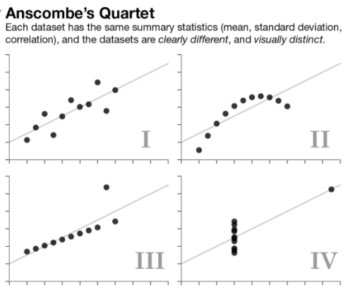

# Exploratory Data Analysis (Linkedin Learning)
1. Queries - Help us understand what subsets of a dataset look like
2. Statistics - Help us understand global properties by using descriptive numeric measures. Like the mean of a column or
   the maximum and minimum values in a column.
3. Visualizations - Help us see the globabl properties of datasets

Problems can occur if we make assumptions about data that is incorrect. E.g. two data sets may have the same average but
the shape of the data sets could be very different. An example of this would be Anscombe's Quartet.


## Exploring Data With Statistics
1. Descriptive Statistics
2. Hypothesis Testing

### Descriptive Statistics
Help us understand the shape and tendency of data.
1. Central Tendency - Different kinds of midpoints in a data set.
2. Spread or Variance - Range of data and how it is spread out.

#### Central Tendency
1. Can be measured by the Mean(Average)
2. Mode - Data value that occurs most frequently
3. Bell Curve
4. Standard Deviation - When our data has a bell curve distribution we can measure standard deviation. We will generally
   talk about the number of standard deviations from the mean. About 65% of data in normally distributed values is 
   within 1 standard deviation. About 95% is found within 2 standard deviations.

## Testing Hypothesis with Statistics
**Hypothesis Testing:** Can help when you have hunches about subsets of the data. And how it differs from sets or other
subsets of the data.

**Examples:** 
+ Customers in southeastern states make more purchases than customers in the northwestern states.
+ Customers over the age of 40 spend more per year than customers under the age of 30.
+ Customers are more likely to click on an ad that includes images than on ads that are all text.

### Hypothesis testing example with Data
| Data Points | Column Names |
|-|-|
| Customer ID | customer_id |
| Customer Name | name |
| Customer Address | address |
| Customer City | city |
| Customer State | state |
| Customer Age | age |
| Number of purchases this year | number_purchases |
| Total amount of purchases this year | amount_purchases |

+ Table Name: customer_summary

**SQL Statements:**
+ Customers over the age of 40
```sql
SELECT *
FROM customer_summary
WHERE age > 40
```
+ Mean number of purchases and mean amount of purchases for customers over 40. We could also edit this statement and
  change it to select all customers under the age of 30.
```sql
SELECT AVG(number_purchase), AVG(amount_purchase)
FROM customer_summary WHERE age > 40
```
+ You could also use other descriptive statistics to explore the data. E.g.
   - MAX
   - MIN
   - MODE
   - STDDEV

#### Significant Difference?
+ Average number of purchases of customer under 30: 12
+ Average number of purchases of customer over 40: 27

Is this difference important to the business question you are attempting to answer? E.g. are the results significant?
There are two ways to assess the significance of this.
+ Intuitive Assessment
   - You are starting a new campaign and so you need to decide what customers to target. You may decide to invest most
      of your efforts in customers over 40 because you feel the difference is significant from a business perspective.
+ **Z-test**: Is the difference between two results statistically significant? Measures the probability that the difference
          between the two averages is not due just to chance.

## Why check Data before Data Analysis?

### Common Problems
+ Missing Values/Data
   - Reasons:
      * Source systems do not require values, in which case there is probably no easy way to find the missing data
      * Errors occur when extracting data from the source system, in which case the problematic code could be corrected
         and rerun
+ Values outside of an expected range
   - Ages less than 0 and greater than 120
   - Month  number less than 1 and greater than 12
   - Dates on transactions earlier than the time the business started
   - Codes, like postal codes or zip codes, that are outise the range of defined values
+ Malformed values/data
   - Names or descriptions that are truncated.
   - Dates formatted with invalid characters
   - Free form text values that have no spoaces between words
+ Values that violate business rules
   - **Business Rules:** Rules that must be satisfied for the data to make sense.
   - An order total is greater than a customer's credit limit
   - The date an order is shipped is earlier than the date it was ordered
   - A product ID in an order refers to a product that is no longer available.
+ Inconsistent values across tables, such as customer IDs. Occurs when relational integrity is not enforced in a 
  database.
  - Order may have an order ID
  - Order items are associated with an order by using order id
  - An order item has an order ID that does not exists in the order table


https://www.linkedin.com/learning/sql-for-exploratory-data-analysis-essential-training/types-of-quality-checks?u=89092386