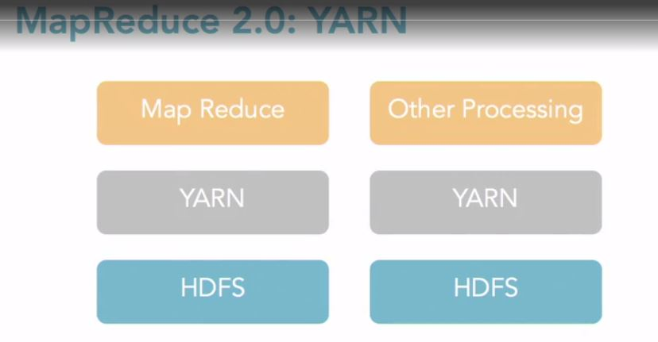
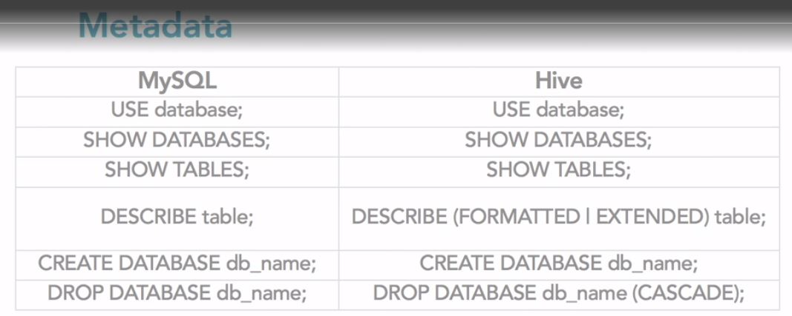
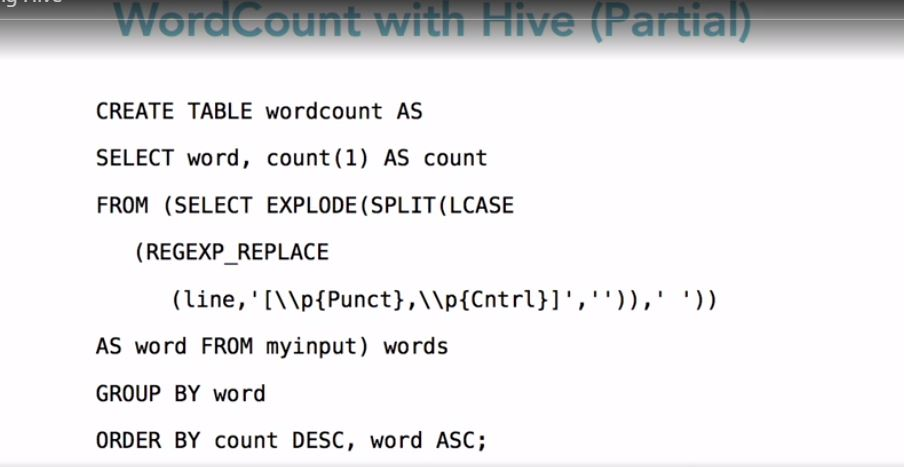
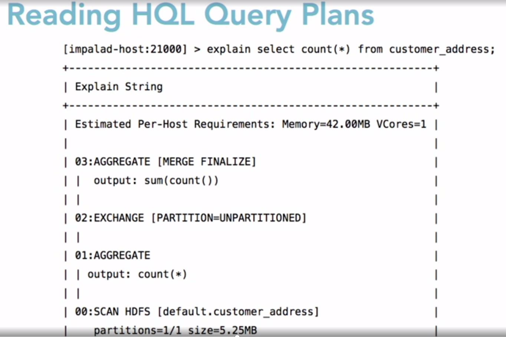

# Hadoop
* Many teams use Hadoop for storage and Spark for computing.
* Spark is integrated into Hadoop pretty well.
* Scalable High Performance Pipelines

## What is Hadoop? (Ref 2)
* Two Components plus projects
    * Open-source data storage: HDFS
    * Processing API: MapReduce
    * Other proejcts/libraries: HBase, Hive, Pig, etc.

## When is Hadoop an Appropriate Tool?

## Hadoop Clusters (Ref 2)
* Open Source (Setup Locally)
    * Apache Hadoop
* Commercial Distribution
    * Cloudera, Hortonworks...
* Public Cloud
    * IaaS - you install/manage (use VM/Docker images)
    * Paas - vendor provides image and management

## RDBMS Limits (Ref 2)
* Scalability
    * It becomes very complex and expensive to grow relational databases into
      the petabyte realm.
* Speed
    * RDBMS not always great for real time
* Others
    * Queryability
    * Sophisticated Processing

## Database Choices (Ref 2)
* File systems
    * Other fields
    * HDFS (Hadoop Distributed File System)
        * Meant to be a replacement for the file system that you are currently
          using.
* Databases
    * NoSQL (key/value, columnstore, etc.)
        * Portions of Hadoop could be classified as NoSQL but Hadoop is not a
          database. It is an alternative file system with a processing library.
    * RDBMS(MySQL, SQL Server)

## Hadoop and HBase (Ref 2)
HBase is the most common implementation for Hadoop.
* Hadoop uses an alternative file system (HDFS)
    * HDFS and GFS are very similar implementations.
* HBase is a NoSQL database (wide columnstore)

## CAP Theory (Ref 2)
CAP Theory says that databases can really only meet of the three points of CAP
Theory.
* Consistency - Allow for very high data consistency.
    * Transactions
* Availability
    * Up-time
* Partitioning
    * Scalability

Hadoop is best for Scalability (Partitioning)
* Designed to run on commodity hardware for data storage. (Meaning it is
  designed to run on cheap/old servers.)
    * By default Hadoop creates 3 copies of the data.
* Flexibility (Availability)
    * Commodity hardware for distributred processing. (Meaning you can scale
      almost infinitely)

## What Kinds of Data for Hadoop? (Ref 2)
Some businesses think Hadoop is a replacement for a relational database but it
really it is a supplement to your relational database.
* LOB (Line of Business) NOT A GOOD FIT
    * Usually transactional and not a good fit.
* Behavioral data GREAT FIT FOR HADOOOP
    * Data that will be batch processed. E.g. processed as a group rather than
      individually queried. If it is mission critical data you will keep that
      in a RDBMS.
    * Healthcare Data - (Fitbit- Walks may be taken randomly)
    * Large volume of data.

-----------------
## Working with Hadoop File System
* The Hadoop file system is immutable so it won't overwrite an existing file.
  The new file would need to have a new name.

In the process shown in the diagram. The sections where you will be writing code
is for the mapping logic and the reducting logic.

## MapReduce API Versions
* Version 1.0
    * org.apache.hadoop.mapred
* Version 2.0
    * org.apache.hadoop.mapreduce

## MapReduce Libraries
import org.apache.hadoop.fs.Path;
import org.apache.hadoop.conf.*;
import org.apache.hadoop.io.*;
import org.apache.hadoop.mapred.*;
import org.apache.hadoop.util.*;

## MapReduce Mapper Code

## MapReduce Mapper Code

To be  able to run the code from above you need to create a main method.

## Key Components
# INSERT MISSING INFORMATION

## Mapper Task Optimization
* Sub-divide tasks
    * Chain jobs
    * 1-3 minutes per map task run
* Custom Partitioner
* Reduce the amount of data (skip bad records)
* Logging and counters
* Monitor/tune for optimal spill ration
    * Spill ratio is when the memory on the mapper machine is overloaded and the
      processing has to spill out to disk. So the ratio is how many records
      spill out to disk vs. those processed in memory.
* Local Reducers
* Set map-only jobs
    * Photo Processing

## Input File Compression
* Vendor Implementation differ
* Read the documentation
* Claoudera's version of LZO is 'Splittable'
* Use the most efficient compression for your vendor.

## Reminder about Data Types
* Use the text type only when you are using text data. Numeric data will perform
  a little bit better when not stored as text.

## Reducer Task Optimization
* Subdividing tasks (chaining jobs)
* Logging Debugging
* Secondary Sort
* Set Thresholds
* Don't user a reducer (create Map-only jobs)
* Use local Reducers (Combiners)

## Creating a Distributed Cache
* Used to cache file

## Limits of MapReduce 1.0
* Only batch processing
    * Not interactive
* Coding MapReduce jobs is complex
    * Not enough developers
    * Jobs don't fit all business scenarios
* Missing Enterprise Features (Security, high availability)

* It adds an abstraction layer between Map Reduce and HDFS.

##  What is Hive?
* SQL-like query language that generates MapReduce code
* H-SQL not 100% compliant with ANSI SQL.
* Batch, not interactive (This causes latency in the results)
* Used with HBase. (Schema on Reads)

## What is HBase?
* Wide-column NoSQL database.
* Use CREATE TABLE over HDFS data.
* Then query with Hive

## Using Hive with Hadoop
* Hive libraries are integrated with HBase.
* Hive libraries include the HQL Language.
* Commercial distributions include Hive.

## Hive Example
* CREATE TABLE
    Col1, Col2
* SELECT Col1, Col2
    FROM table

* Joins are very expensive to perform.

## Working with Hive
* Starting the Hive Service
* Managing the metastore database
    * Stores the metadata for Hive tables in a database
    * Can be embedded, local, or remote
    * Schema tool: offline tool for schema manipulation

## Why Use Hive?
* You're an analyst (background in ANSI SQL)
* You know SQL
* You want to ask analytical questions
* Hive is not as useful for data cleansing. It can be done but it is cumbersome.
  If this is what you want to do you would want to use the lower level language
  like Java or Pig.
* Hive is batch, not interactive
* JOINs function differently than on RDBMSs

## WordCount with Hive
* Create HBase table for text input
* Load your data into the table
* Create new destination table
* Load that table with the processed results.

* This shows that Hive is not the best thing to use to solve this word count
  problem. This is more of a parsing problem.

* This should be read bottom to top.

## What is Pig?
* ETL Library for Hadoop
    * Generates MapReduce Jobs
    * Developed at Yahoo!
* Uses the Pig Latin Language
    * Oink
    * Grunt

## When Do You Use Pig?
* For ETL-like jobs
    * Transform Data
    * Clean Data
    * Process Data

## How Does Pig Work?
* ETL process and flow
    * LOAD \<file>
    * FILTER, JOIN, GROUP BY, FOREACH, GENERATE \<values>
        * Generate allows you to do some process and then generate some new
          values.
    * DUMP \<to screen for testing>
    * STORE \<new file>
* The words in all capitals are the key words for Pig.

## Pig Concepts: Data
* Field: a piece of data
* Tuple: a set of fields
* Bag: a collection of tuples
* Relation: a complete database

## Pig Concepts: Filters
* FILTER \<set> BY \<value> = \<number>
    FILTER A BY quantity > 2000;
* Supported operators
    * Logical: NOT, AND, OR
    * Relational: <,>, ==, !=, >=, <=

## Pig Concepts: Functions
* Pig includes a rich function library (They usually have more than ANSI SQL)
    * General: AVG, MAX, TOKENIZE (Splits text into words)
    * Relation: FILTER, MAPREDUCE (You can call mapreduce jobs from within pig)
    * String: LOWER, SUBSTRING
    * Math: ABS, LOG, ROUND
    * Loading/Storage: JSONLOADER

## Pig Concepts: UDFs
* User Defined Functions can be used to optimize functions
    * Write the function
    * Register the function
    * Test the function
    * Can be written in Java or Python

## How Do You Run Pig Scripts?
* Script/Batch mode: run from the Hadoop shell. (Testing)
* Grunt/Interactive mode: start with the Pig shell (Testing)
* Embedded mode: within Java (Production)

## WordCount with Pig
lines = LOAD '/user/hadoop/HDFS_File.txt' AS (line:chararray);
words = FOREACH lines GENERATE FLATTEN(TOKENIZE(line)) as word;
grouped = GROUP words BY word;
wordcount = FOREACH grouped GENERATE group, COUNT(words);
DUMP wordcount;

* The wordcount variable is where the aggregate will be generated.
* words and group variable is where the mapper will be generated.

## What is Oozie?
* Workflow scheduler library for Hadoop jobs
* Used to schedule reoccurring jobs
* It is a type of ETL tool
* Used to schedule Hive, Pig, and others
* Can schedule based on time and other factors

## Oozie Tools and Syntax
* Syntax
    * Around jobs and bundles (of jobs)
    * Start, stop, suspend, resume, info...
    * Core syntax is XML
* Tool: Cloudera Hue Browser

## Optimize Oozie Workflows
* Various vendors implement
    * Hortonworks has a "better scheduler"
* Use an alternative product/vendor
    * Luigi or Azkaban

## What is Sqoop?
* Command-line utility for transferring data between RDBMS systems and Hadoop.
    * for import and export
* Can be used to load directly into Hive or HBase tables
* Connectors for Oracle, SQL Server, others

## Sqoop Syntax

## Optimizing Sqoop
* Direct dump vs. JDBC
* Monitor number of parallel connections
* Use a thrid-party product
* Tip: Sqoop 1 has more features than Sqoop 2

## What is Zookeeper?
* Centralized service for Hadoop configuration information
* Allows for distributed applications
* Creates an "ensemble" of applications
* Is part of some vendor distributions

## Why Use Zookeeper?
* Distributed in-memory computation
    * e.g. capture information about what someone is doing in an online game and
      then send them adds based on what they are doing in the game.
    * With some data shared between client nodes
    * Where data synchronization matters
    * Includes locking, sync, queues, and more
* Zookeeper is Free.

## Optimizing Zookeeper
* Very complex to set up in production
    * Must be configured correctly
    * Must be tested with production-level workloads
* Often thrid-party products are used

## What is Spark?
* In-memory distributed data analysis
* Similar to Impala in Cloudera
* Goal is to speed up job
    * Batches
    * Machine Learning
    * Interactive Queries

## How to Use Spark
* Included with some distributions
    * Cloudera

## Comparison of Tools
### Storm
* Near-real-time event stream processing
### Impala
* In-memory columnstore
### Spark
* In-memeory Hadoop
* YARN-ready
* Hive in memeory

## Apache Spark Dominates Industry
* In-memeory is FAST
* Spark/Databricks is well-funded
* Spark adds libraries
* Spark adds services (MLFlow)
* Cloudera fades
* Others fold or sell
* Hadoop/Spark = growth

## Machine Learning and Hadoop/Spark
* TensorFlow
* GPUs
* DNNs/CNNs
* Spark adds services (MLFLow)
* Mahout (Hadoop Library)
* Sci-kit learn
* K-Means, etc...

## Hadoop and Machine Learning
1. Massive data volumes
2. Computational complexity
3. Iteration
4. Often adds Spark

Increasingly, Hadoop/Spark workloads run on public cloud Data Lakes instead of
HDFS
* Public cloud data lakes

## Hadoop Cluster FileSystems
* DataLakes are cheap
* DataLakes are flxible (other services can use)
* Less Data Movement
* AWS S3/GCP GCS lead
* NTFS fades
* Others DFS remain (Databricks File System (DFS))
* Still others - fade

You can now use Kubernetes in place as your scheduler in place of YARN. That
allowed them to switch from using HDFS to S3 as a true DataLake File System

## Visualizing Hadoop Job Output
* Visualization Libraries
    * Ganglia - cluster performance
    * 3rd party/public cloud - GCP Stackdriver
* Viualization Products
    * Tableau to custom clients (D3, etc...)

## Continued Learning
* Focus on a subset of Hadoop skills
    * Developer/analyst: writing queries
    * Administrator: Monitoring and security

------------
# References
1. Linkedin Learning: Big Data Analytics with Hadoop and Apache Spark (Need 
   prior experience with Haddoop and Spark for this course)
2. [Linkedin Learning: Learning Hadoop By: Lynn Langit](https://www.linkedin.com/learning/learning-hadoop-2/getting-started-with-hadoop?u=89092386)