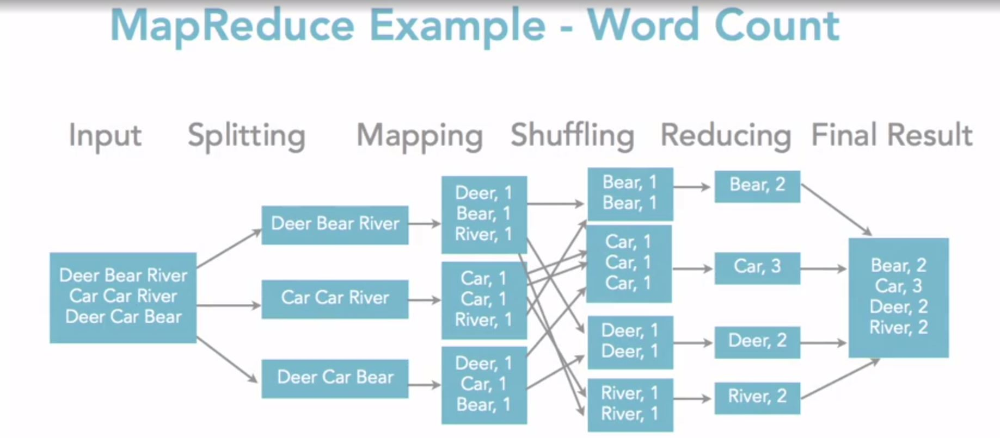
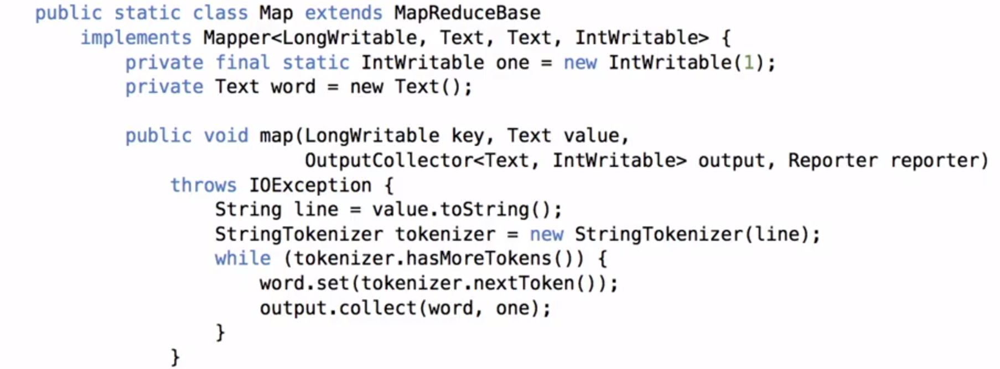
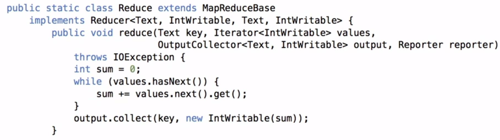
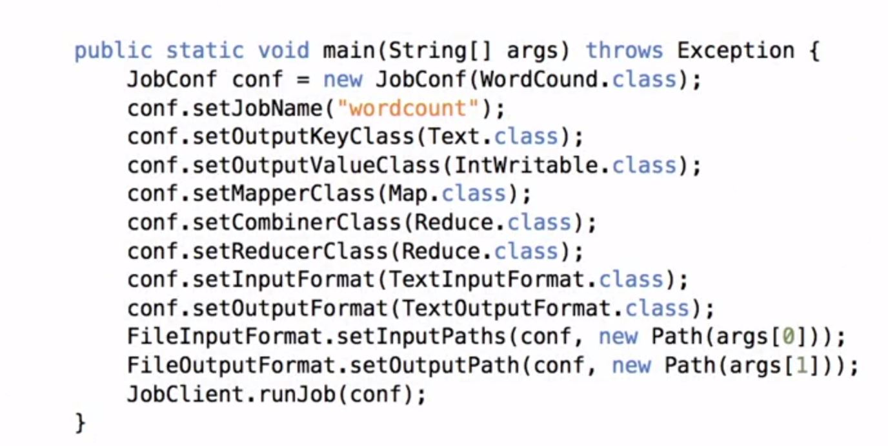

# Hadoop
* Many teams use Hadoop for storage and Spark for computing.
* Spark is integrated into Hadoop pretty well.
* Scalable High Performance Pipelines

## What is Hadoop? (Ref 2)
* Two Components plus projects
    * Open-source data storage: HDFS
    * Processing API: MapReduce
    * Other proejcts/libraries: HBase, Hive, Pig, etc.

## When is Hadoop an Appropriate Tool?

## Hadoop Clusters (Ref 2)
* Open Source (Setup Locally)
    * Apache Hadoop
* Commercial Distribution
    * Cloudera, Hortonworks...
* Public Cloud
    * IaaS - you install/manage (use VM/Docker images)
    * Paas - vendor provides image and management

## RDBMS Limits (Ref 2)
* Scalability
    * It becomes very complex and expensive to grow relational databases into
      the petabyte realm.
* Speed
    * RDBMS not always great for real time
* Others
    * Queryability
    * Sophisticated Processing

## Database Choices (Ref 2)
* File systems
    * Other fields
    * HDFS (Hadoop Distributed File System)
        * Meant to be a replacement for the file system that you are currently
          using.
* Databases
    * NoSQL (key/value, columnstore, etc.)
        * Portions of Hadoop could be classified as NoSQL but Hadoop is not a
          database. It is an alternative file system with a processing library.
    * RDBMS(MySQL, SQL Server)

## Hadoop and HBase (Ref 2)
HBase is the most common implementation for Hadoop.
* Hadoop uses an alternative file system (HDFS)
    * HDFS and GFS are very similar implementations.
* HBase is a NoSQL database (wide columnstore)

## CAP Theory (Ref 2)
CAP Theory says that databases can really only meet of the three points of CAP
Theory.
* Consistency - Allow for very high data consistency.
    * Transactions
* Availability
    * Up-time
* Partitioning
    * Scalability

Hadoop is best for Scalability (Partitioning)
* Designed to run on commodity hardware for data storage. (Meaning it is
  designed to run on cheap/old servers.)
    * By default Hadoop creates 3 copies of the data.
* Flexibility (Availability)
    * Commodity hardware for distributred processing. (Meaning you can scale
      almost infinitely)

## What Kinds of Data for Hadoop? (Ref 2)
Some businesses think Hadoop is a replacement for a relational database but it
really it is a supplement to your relational database.
* LOB (Line of Business) NOT A GOOD FIT
    * Usually transactional and not a good fit.
* Behavioral data GREAT FIT FOR HADOOOP
    * Data that will be batch processed. E.g. processed as a group rather than
      individually queried. If it is mission critical data you will keep that
      in a RDBMS.
    * Healthcare Data - (Fitbit- Walks may be taken randomly)
    * Large volume of data.

-----------------
## Working with Hadoop File System
* The Hadoop file system is immutable so it won't overwrite an existing file.
  The new file would need to have a new name.

In the process shown in the diagram. The sections where you will be writing code
is for the mapping logic and the reducting logic.

## MapReduce API Versions
* Version 1.0
    * org.apache.hadoop.mapred
* Version 2.0
    * org.apache.hadoop.mapreduce

## MapReduce Libraries
import org.apache.hadoop.fs.Path;
import org.apache.hadoop.conf.*;
import org.apache.hadoop.io.*;
import org.apache.hadoop.mapred.*;
import org.apache.hadoop.util.*;

## MapReduce Mapper Code

## MapReduce Mapper Code

To be  able to run the code from above you need to create a main method.

## Key Components

------------
# References
1. Linkedin Learning: Big Data Analytics with Hadoop and Apache Spark (Need 
   prior experience with Haddoop and Spark for this course)
2. [Linkedin Learning: Learning Hadoop By: Lynn Langit](https://www.linkedin.com/learning/learning-hadoop-2/getting-started-with-hadoop?u=89092386)